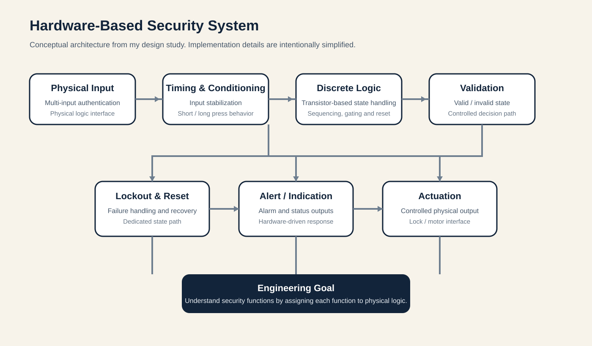

# Hardware-Based Security System — Discrete Logic Design Study

I designed this as a personal engineering study into hardware-based authentication and physical access control.

I wanted to see how far I could take the design without starting with a conventional software controller.

The main question was simple:

> What happens when each security function is treated as a physical logic problem?

I worked through the design at component level and broke it into smaller functions so I could study timing, state, validation, failure handling and physical outputs.

## What I explored

- input conditioning before validation;
- hardware timing;
- representing sequences and state with discrete logic;
- separating valid and invalid conditions;
- hardware lockout behaviour;
- alarm and indication;
- physical actuation;
- how the different blocks behave when connected together.

## Architecture

I have kept the public architecture at block level because the original design contains more implementation detail.

**Physical input → timing and conditioning → discrete logic → validation → controlled response**

I separated the response side into:

- **Lockout and reset**
- **Alert / indication**
- **Actuation**

This makes the overall design easier to explain without publishing the full implementation.

## Why I used discrete logic

I deliberately started with individual components instead of hiding the logic behind a microcontroller.

That meant I had to make each function explicit.

A timing problem became a timing circuit.  
A state problem became a state circuit.  
A validation problem became a logic path.  
A lockout condition became a separate physical state.

That made the trade-offs much easier to see.

## The main challenge

The main challenge was complexity.

As I added more states and conditions, the number of components and interconnections grew quickly. One of the clearest lessons for me was that removing software does not remove complexity. It can simply move that complexity into the physical design.

That led me to think about how the architecture could be made more efficient while keeping the same general control approach.

## What I learned

### Decomposition matters

A complicated system is easier to reason about when each function has a clear job.

### Hardware has state too

Working with physical state made me think carefully about what creates, holds, clears and changes state.

### Security is more than authentication

I also had to think about invalid input, lockout, recovery, alerting, power behaviour and the physical output.

### Design trade-offs matter

A software-free design can remove one class of dependency while making the physical system larger and harder to maintain.

## My role

I designed the architecture and developed the logic as a personal study.

I worked through the system at component level, broke it into smaller functions and studied how those functions interacted.

## Public version

I have not published the original schematic or the detailed implementation.

That includes the exact authentication logic, wiring topology, timing values, recovery details and other implementation-specific security paths.

The version here is meant to show the engineering problem, the architecture and the reasoning behind the design.

## Status

**Design study / prototype architecture**

This is an engineering exploration, not a claim that the design is production-certified or suitable for security-critical deployment without further testing and validation.
